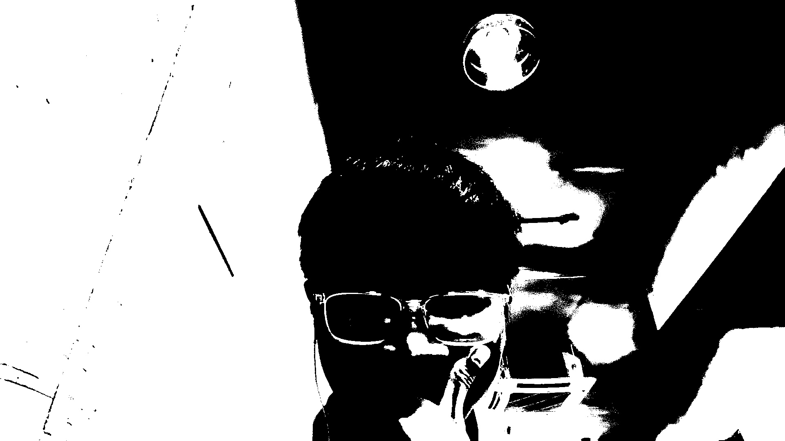
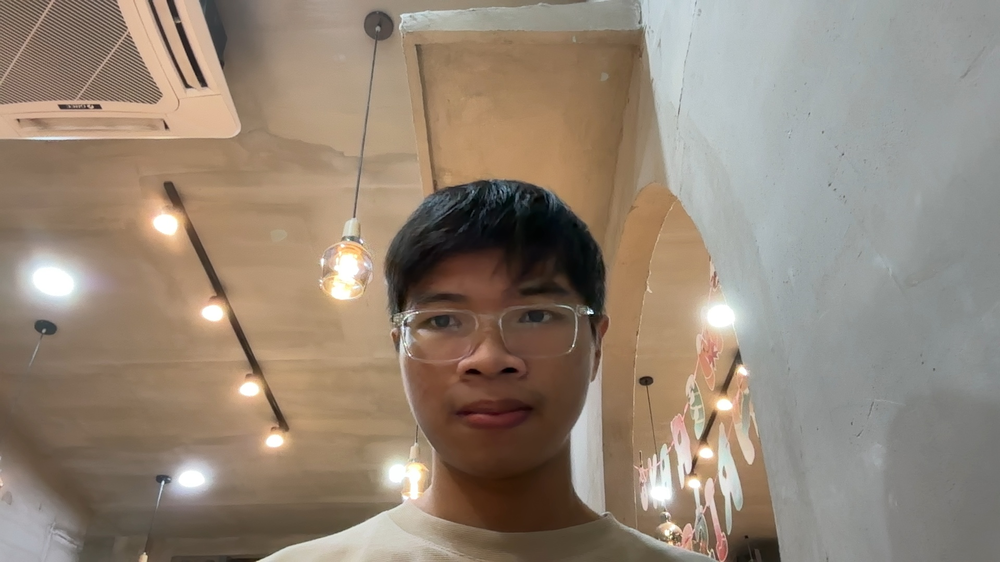
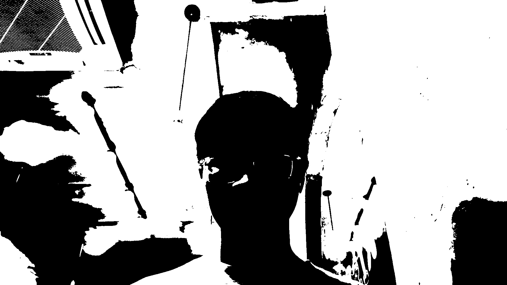
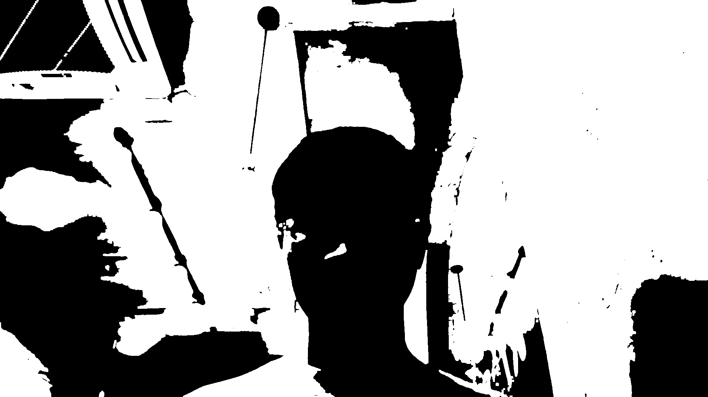
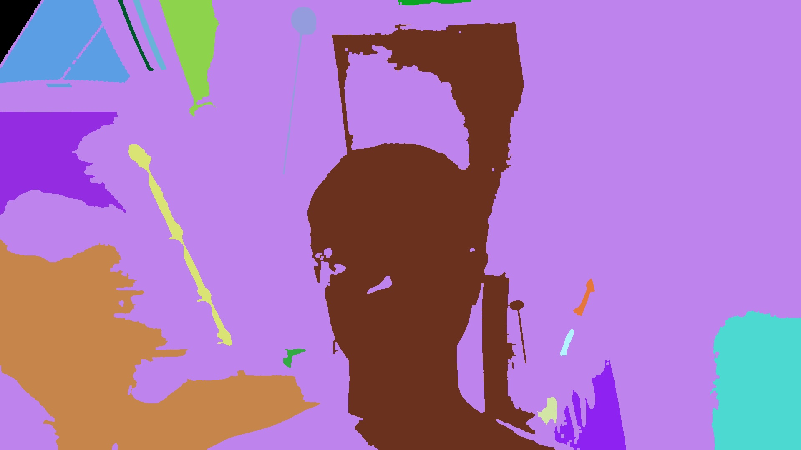

# VisionMac
This project develops an Object Recognition (OR) system on macOS designed to identify objects within video footage. The system employs computer vision methods and algorithms to analyze video frames. This involves image preprocessing steps such as thresholding and cleaning, followed by image segmentation to isolate object regions. Feature extraction is then performed on these regions, which are compared against a database of known objects to enable real-time classification. This report provides a comprehensive overview of the technical aspects, visual examples, and insights gained throughout the development process.

## Requirements
- OpenCV 4.10.0
- macOS Sequoia 15.2

## Project Report
### I. Thresholded Objects

The thresholding process is a crucial step in the VisionMac project, which aims to identify objects within video footage. This section of the report will delve into the technical details of the thresholding algorithm implemented in the project, highlighting its role in the overall object recognition system.

1. #### Thresholding Process Overview
    The thresholding process in VisionMac is designed to convert a color image into a binary image, where the objects of interest are separated from the background. This is achieved through a series of image processing steps, as outlined in the [thresholding.mm](thresholding.mm) file.

2. #### Dynamic Thresholding Algorithm
    The [dynamicThresholding](thresholding.mm) function is the core of the thresholding process. It involves the following steps:

    - ##### Pre-processing with Gaussian Filter 
      The input image is first smoothed using a Gaussian filter to reduce noise and detail, which helps in achieving a more accurate thresholding result.
    - ##### Color Space Conversion
      The blurred image is converted from the BGR color space to the LAB color space. This conversion is beneficial as the LAB color space separates the luminance from the color information, making it easier to perform thresholding based on intensity.
    - ##### K-Means Clustering
      The image is reshaped into a 1D array and converted to a floating-point format. K-means clustering is then applied to segment the image into two clusters. This segmentation helps in distinguishing the object from the background based on color intensity.
    - ##### Threshold Calculation
      The average intensity of the two clusters is calculated, and the threshold value is set as the average of these two means. This dynamic calculation allows the threshold to adapt to different lighting conditions and object colors.
    - ##### Image Thresholding
      The [thresholdImage](thresholding.mm) function applies the calculated threshold to the original image, setting pixels below the threshold to black and those above to white, effectively isolating the objects.

3. #### Implementation Details
    The implementation of the thresholding process is encapsulated in the [thresholding.mm](thresholding.mm) file. The key functions involved are:
    ```cpp
    // Handles the entire thresholding process, from pre-processing to threshold application.
    void dynamicThresholding(const cv::Mat &src, cv::Mat &dst);
    ```
   ```cpp
   // Applies the calculated threshold to produce a binary image.
   void thresholdImage(const cv::Mat &src, cv::Mat &dst, int thresholdValue);
   ```

4. #### Results
    
       *Original video frame image*
   
    
       *Thresholded video frame image*

5. #### Conclusion
    The thresholding algorithm implemented in VisionMac is a vital component of the object recognition pipeline. By dynamically adjusting the threshold based on image content, it provides a reliable method for object isolation, paving the way for subsequent feature extraction and classification steps.

### II. Cleaned Objects and Segmentation

The cleaning and segmentation processes are essential steps following thresholding in the VisionMac project. These steps further refine the binary images to enhance object isolation and prepare them for feature extraction and classification.

1. #### Cleaning Process Overview
    The cleaning process involves morphological operations that help in removing noise and small artifacts from the thresholded images. This is achieved using erosion and dilation techniques, which are implemented in the [morphologicalOperations.mm](morphologicalOperations.mm) file.

2. #### Morphological Operations
    The [applyMorphologicalOperations](morphologicalOperations.mm) function is responsible for cleaning the thresholded images. It involves the following steps:

    - ##### Erosion
      Erosion is applied to remove small white noise and detach connected objects. This operation uses a kernel to erode away the boundaries of the foreground object.
    - ##### Dilation
      Following erosion, dilation is applied to restore the eroded parts of the object. This operation uses a kernel to dilate the boundaries of the foreground object, ensuring that the object remains intact while noise is minimized.

3. #### Segmentation Process Overview
    After cleaning, the segmentation process labels connected components in the binary image. This step is crucial for identifying distinct objects within the frame.

4. #### Connected Components Labeling
    The [labelConnectedComponents](main.mm) function labels each connected component in the cleaned image. It involves:

    - ##### Inversion and Labeling
      The binary image is inverted, and connected components analysis is performed to label each distinct object. The function also filters out components smaller than a specified minimum size to reduce false positives.
    - ##### Coloring
      The [colorConnectedComponents](main.mm) function assigns a unique color to each labeled component, making it easier to visualize and distinguish between different objects.

5. #### Implementation Details
    The implementation of the cleaning and segmentation processes is encapsulated in the [morphologicalOperations.mm](morphologicalOperations.mm) and [main.mm](main.mm) files. The key functions involved are:
    ```cpp
    // Applies erosion and dilation to clean the thresholded image.
    void applyMorphologicalOperations(const cv::Mat &src, cv::Mat &dst);
    ```
    ```cpp
    // Labels connected components in the cleaned image.
    cv::Mat labelConnectedComponents(const cv::Mat &src, int minSize, cv::Mat &stats);
    ```

6. #### Results
    
       *Original video frame image*
   
    
       *Thresholded video frame image*
   
    
       *Morphological video frame image*
   
    
       *Segmented video frame image*

8. #### Conclusion
    The cleaning and segmentation processes are integral to the VisionMac object recognition pipeline. By effectively removing noise and labeling distinct objects, these processes enhance the accuracy of subsequent feature extraction and classification steps.
